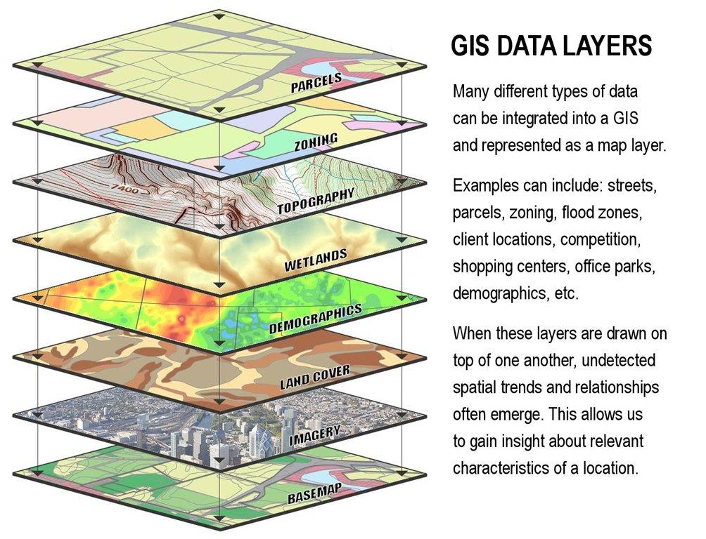

## unit-25-wzhaosgg

#### 1. Words

#### 2. Translate the first paragraph of the text.

#### 3. Find all the terminology in the figure and translate them to Chinese.

#### 3. Describe this figure in English.

