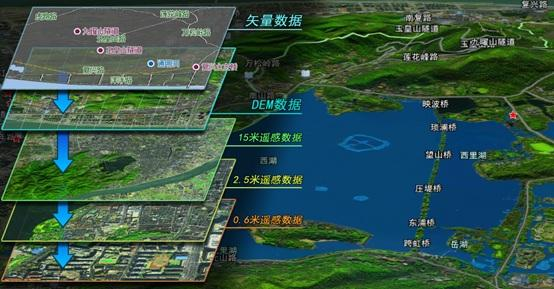

## Student ID: *********

### 1. Words 

+ Geographic Information System (GIS) : 地理信息系统
+ Global Positioning System (GPS) : 全球定位系统
+ Remote Sensing (RS) : 遥感

### 2. First Paragraph

A geographic information system (GIS) is a system designed to capture, store, manipulate, analyze, manage, and present spatial or geographic data. The acronym GIS is sometimes used for geographic information science (GIScience) to refer to the academic discipline that studies geographic information systems[1] and is a large domain within the broader academic discipline of geoinformatics.[2] What goes beyond a GIS is a spatial data infrastructure, a concept that has no such restrictive boundaries.

地理資訊系统（英语：Geographic Information System，縮寫：GIS）是一门综合性学科，结合地理学与地图学，已经广泛的应用在不同的领域，是用于输入、存储、查询、分析和显示地理数据的计算机系统。

### 3. Find all the terminology in the figure and translate them to Chinese.

+ Geographic Information System (GIS) : 地理信息系统
+ Global Positioning System (GPS) : 全球定位系统
+ Remote Sensing (RS) : 遥感

